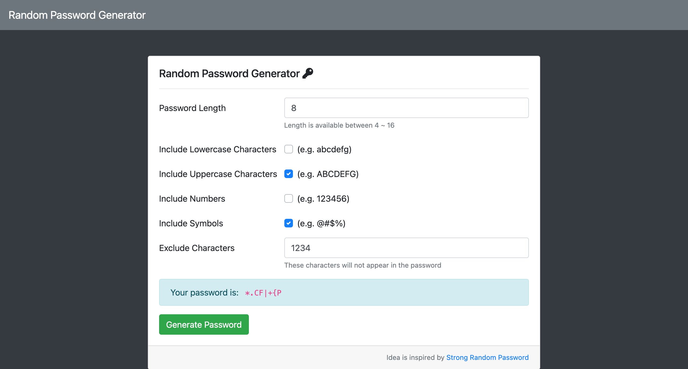

# Random Password Generator

一個簡單的隨機密碼產生器

## Preview



## Prerequisites

- Body-Parser v1.19.0
- Express v4.17.1
- Express-Handlebars v5.3.2

## Installing

1. 打開終端機 (Terminal) 輸入以下訊息，下載專案至本機

```
git clone https://github.com/juifengchi/password-generator.git
```

2. 進入專案目錄資料夾

```
cd password-generator
```

3. 安裝 npm 套件

```
npm install
```

4. 啟動伺服器來執行專案

```
nodemon app.js
```

5. 出現以下訊息即可打開瀏覽器輸入 http://localhost:3000 開始使用

```
Express app listening on port 3000.
```
